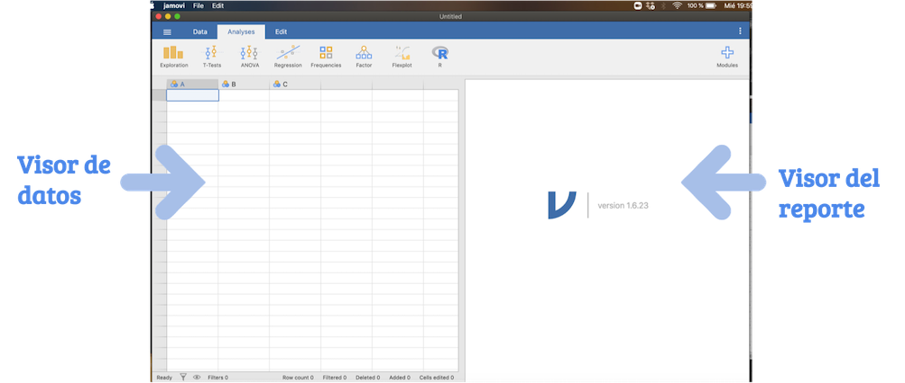

# Introducción a Jamovi

## ¿Por qué Jamovi para el sector público?

Jamovi es un programa gratuito para realizar cálculos estadísticos, es decir, facilita el proceso de adquisión de licencias de otros softwares estadísticos de pago.

Es un software de fácil uso, debido a que desde su creación se consideró la versatilidad del SPSS, uno de los softwares de pago más empleados en el análisis estadísticos. Jamovi es una interfaz gráfica de R, un software muy pontente  basado en el lenguaje de objetos.

Jamovi también nos permitirá realizar un reporte en pdf y guardar nuestro nuevos avances como un proyecto. 

## ¿Cómo instalar JAMOVI?

En el siguiente link https://www.jamovi.org/download.html puede encontrar el instalador para Windons y Mac. Se recomienda instalar la versión SOLID,recomendada para la mayoría de usuarios.

## Primeros pasos en JAMOVI

Lo primero que observaremos al abrir en el software es el visor de datos y el visor de reporte. 

En la sección superior de la ventana se observará el menú de Jamovi compuesto por : 

- **Inicio**  (tres lineas)

  - Nuevo: Abrir un nuevo archivo

  - Abrir: Abrir un archivo existente que puede ser una bases de datos o un proyecto de Jamovi.

  - Importar: Para importar una base de datos.

  - Guardar: Guardar el proyecto de Jamovi. 

  - Guardar como: Guardar el proyecto de Jamovi. También se puede guardar la base de datos modificada en Jamovi como un archivo delimitado por comas.

  - Exportar: Exportar el archivo del reporte a pdf.

- **Data**

  - Pegar / Copiar / Cortar
  
  - Setup: Ver el tipo de medida de variables, la unidad de medida y los valores.
  
  - Compute : Crear nuevas variables.
  
  - Transformar variables
  
  - Añadir/ Eliminar variables
  
  - Filtros: Seleccionar una sección de la base de datos.
  
  - Añadir filar.
  
- **Análisis**

  - Exploración descriptiva
  
  - Prueba T
  
  - Anova
  
  - Regresión
  
  - Análisis factorial

- **Edición**

Edicción del formato del reporte.

  - Negrito
  
  - Cursiva
  
  - Subrayado
  
  - Tachado
  
  - Color de letra
  
  - Fórmula

- **Formato** (tres puntos)

