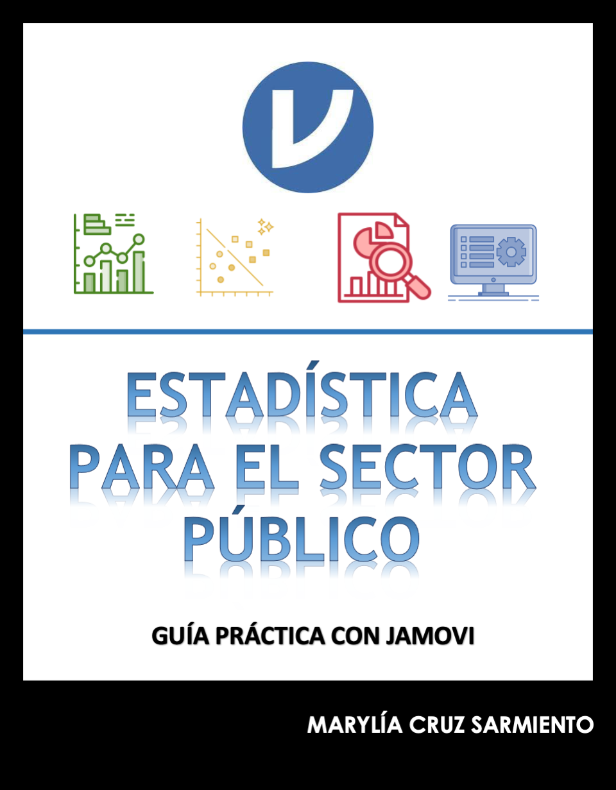

--- 
title: "Estadística para el Sector Público con Jamovi"
author: "Marylía Cruz Sarmiento"
date: '2021'
output:
  html_document:
    df_print: paged
site: bookdown::bookdown_site
documentclass: book
---

# Estadística para el Sector Público con Jamovi{-}

Este _libro_ es una guía práctica que  tiene como objetivo principal ser una herramienta para el aprendizaje de estadística para el sector público utilizando el software libre **JAMOVI**, y está especialmente dirigido a estudiantes de la Maestría de Gobierno y Políticas Públicas de la Escuela de Gobierno y Políticas Públicas - Pontificia Universidad Católica del Perú (PUCP).

## Sobre la autora

Marylía Cruz,  cientista política  por la Pontificia Universidad Católica del Perú PUCP con Maestría en Estadística  por la Pontificia Universidad Católica del Perú.
